# `karthik@github:~$ whoami`

**Karthik Vana** · AI/ML Engineering · Data Science · Generative AI

Building practical ML, RAG, computer-vision and multi-agent systems — from data preparation through evaluation and deployment.

## `karthik@github:~$ ./contributions.sh`

  

## `karthik@github:~$ whoami`

<table>
  <tr>
    <td valign="top" width="50%">
      
    </td>
    <td valign="top" width="50%">
      
    </td>
  </tr>
</table>

Prefer static images or have SVG animation disabled? Use the [static contribution heatmap](assets/contrib-heatmap-static.svg), [static ASCII portrait](assets/karthik-ascii-static.svg), and [static profile card](assets/info-card-static.svg).

---

## About me

I am an AI/ML engineer with hands-on experience building machine-learning, deep-learning and Generative AI systems. My work spans RAG pipelines, multi-LLM applications, computer vision, predictive models, data analysis and deployment. I am pursuing an **M.Tech in CSE (Artificial Intelligence & Machine Learning)** at Avanthi Institute of Engineering & Technology (JNTU-GV), after completing a B.Tech in Electrical & Electronics Engineering at Raghu Engineering College.

My research experience includes the **SRIP-2026 Big Data Analytics Research Fellowship at Goa Institute of Management**, where I worked on blockchain-based agent-to-agent authentication for multi-agent AI systems.

## Technical skills

| Area | Tools and concepts |
|---|---|
| Programming & data | Python, Pandas, NumPy, Matplotlib, Seaborn, Power BI |
| Machine learning | Scikit-learn, XGBoost, Random Forest, Gradient Boosting, SMOTE, hyperparameter tuning |
| Deep learning & computer vision | TensorFlow, Keras, CNNs, LSTM, ResNet50, VGG16, transfer learning, OpenCV, image classification |
| Generative AI & NLP | LangChain, LangGraph, AI agents, RAG pipelines, prompt engineering, Hugging Face Transformers, OpenAI APIs, NER, sentiment analysis, vector databases |
| Databases, deployment & cloud | MySQL, PostgreSQL, MongoDB, Redis, Flask, Docker, Gunicorn, Streamlit, AWS, GCP, Git |

## Selected projects

### [FoodVision AI — Food Classification & Nutrition Engine](https://github.com/karthik-vana/FoodVision-AI)
Three CNN architectures classify **34 food categories**, with automated nutrient inference. The CV lists TensorFlow, ResNet50, VGG16, Flask, Redis, Docker and Gunicorn, with deployment to Hugging Face Spaces.

### [Telecom Customer Retention System](https://github.com/karthik-vana/Telecom-Retention-System)
A seven-step machine-learning pipeline over **7,043 records**, with a Flask REST API deployed on Render. **CV-reported results:** 98.5% accuracy, ROC-AUC 0.92 and F1 0.89. Stack: XGBoost, SMOTE, Scikit-learn and Flask.

### [Credit Card Risk Prediction System](https://github.com/karthik-vana/CREDIT-CARD_PREDICTION-)
Five machine-learning models process **150,000+ financial records** for risk scoring. **CV-reported results:** 85%+ accuracy, ROC-AUC 0.88 and recall 82.4%. Stack: XGBoost, Random Forest, SMOTE, Flask and Render.

### ShopMind AI — Multi-LLM E-Commerce Chatbot
A production shopping assistant using Python, Groq API, Streamlit and LLaMA 3.3 70B. The CV reports sub-2-second responses, 9 LLMs, 6 personas and 14 languages, with deployment on Streamlit Cloud. A matching public repository URL was not independently located, so no repository link is guessed here.

Project metrics are reproduced from the supplied CV and are not independently re-benchmarked in this repository.

## Research & experience

**Goa Institute of Management — Big Data Analytics Fellow, SRIP-2026** · Apr–Jun 2026  
Collaborated with senior faculty on blockchain-based agent-to-agent authentication research, designed an authentication protocol for multi-agent AI systems, and authored the resulting research paper.

**The Skill Union — AI/ML Engineer** · Aug 2025–Apr 2026  
Built RAG components with LangChain and OpenAI GPT-4 APIs; refined prompts and response tuning; integrated TensorFlow computer-vision models; evaluated models and configured vector databases.

**Innomatics Research Labs — Data Science with GenAI Intern** · Nov 2025–Mar 2026  
Contributed to end-to-end industry-oriented Data Science and GenAI projects involving MLOps, RAG, AI agents, LangChain, LangGraph, prompt engineering and AWS.

## Publication

**Power Quality Enhancement in Microgrid System Using PV-Based UPQC** — IJSREM, Apr 2025. ISSN: 2582-3930 · DOI: [10.55041/IJSREM44631](https://doi.org/10.55041/IJSREM44631). The CV lists an impact factor of 8.586.

## Certifications & highlights

- Oracle OCI Gen AI Professional (2025–2027) and Oracle OCI Data Science Professional.
- Google Advanced Data Analytics (Coursera); Google Gemini for Workspace (2025–2028); AWS Machine Learning (Mar 2026).
- UIDAI Data Hackathon 2026 — ML anomaly-detection system shortlisted among national entries, as described in the CV.
- Tata Group GenAI Simulation (Forage) and Deloitte Data Analytics Simulation (Forage).
- Government of Andhra Pradesh — 4-Year Full Merit Scholarship Awardee.
- Internshala Student Ambassador (2025); peer mentor for Python and ML fundamentals.

## Contact

- **GitHub:** [github.com/karthik-vana](https://github.com/karthik-vana)
- **LinkedIn:** [linkedin.com/in/karthik-vana](https://linkedin.com/in/karthik-vana)
- **Email:** [karthikvana236@gmail.com](mailto:karthikvana236@gmail.com)

---

Generated with self-contained SVG and Python tooling. Contribution data is labelled unverified until the public GitHub calendar can be fetched and validated. Local portrait source files are intentionally excluded from the repository.
